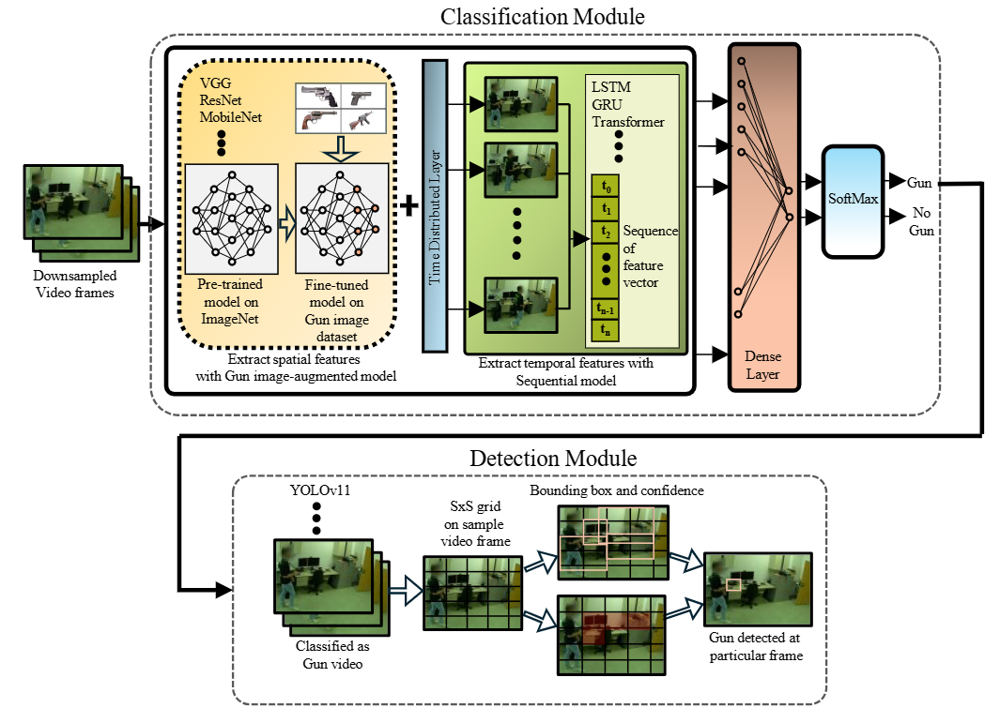

# Gun Detection

This repository is the implementation of the paper **Accurate and Efficient Two-Stage Gun Detection in Videos**.

Paper Link: https://arxiv.org/pdf/2503.06317?

# Proposed Method Overview

**Abstract:** Object detection in videos plays a crucial role in advancing applications such as public safety and anomaly detection. Existing methods have explored
different techniques, including CNN, deep learning, and Transformers, for
object detection and video classification. However, detecting tiny objects,
e.g., guns, in videos remains challenging due to their small scale and varying
appearances in complex scenes. Moreover, existing video analysis models for
classification or detection often perform poorly in real-world gun detection
scenarios due to limited labeled video datasets for training. Thus, developing
efficient methods for effectively capturing tiny object features and designing
models capable of accurate gun detection in real-world videos is imperative. To address these challenges, we make three original contributions in
this paper. First, we conduct an empirical study of several existing video
classification and object detection methods to identify guns in videos. Our
extensive analysis shows that these methods may not accurately detect guns
in videos. Second, we propose a novel two-stage gun detection method. In
stage 1, we train an image-augmented model to effectively classify “Gun”
videos. To make the detection more precise and efficient, stage 2 employs
an object detection model to locate the exact region of the gun within video
frames for videos classified as “Gun” by stage 1. Third, our experimental results demonstrate that the proposed domain-specific method achieves significant performance improvements and enhances efficiency compared with
existing techniques. We also discuss challenges and future research directions
in gun detection tasks in computer vision.

# Installation

pip install -r requirements.txt

# How to use.
The Jupyter Notebooks placed in the Gun detection folder trains the Gun Video Classifciation model and the Notebook YOLOv11_GunDetection applies the fine-tuned YOLOV11 model on the Gun-Classified videos to find the exact region of Gun appearance within the video frames.

1. Place you data set witin the Gun detection folder and replace the path to train the Gun Video Classifciation models and run every cell of the notebooks.
2. Fine-tune the YOLOV11 model with your dataset, place the fine-tuned weights in the root directory and run the YOLOv11_GunDetection notebook to detect the exact region of Gun appearance. 
